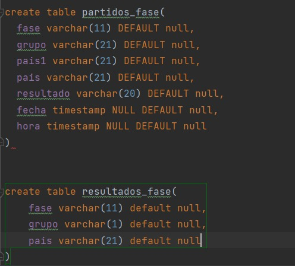

# Eurobasket 2022
### Implicados: Lucas, Juan y Daniel Perez
En el proyecto de creación de la base de datos de Eurobasket de 2022 Masculino en MySQL la tabla que debemos crear 
una base donde contenga las tablas

## Instalación

## Diseño

La base de datos que tenemos que realizar es la de **Eurobasket 2022 del torneo Masculino**.
Contiene seis tablas en total:
### Tabla GRUPOS:
La tabla GRUPOS contiene los grupos (A, B, C, D) y el nombre de los paises que juegan en cada grupo

### Tabla PARTIDOS-FASES y tabla resultados fases:
La tabla PARTIDOS-FASES muestra los partidos que se han realizado de los grupos en cada fase, con el equipo 1 contra
el equipo 2 y con un resultado de los puntos que han conseguido cada uno. La tabla FASES permite indica los grupos 
y sus equipos en la fase que se encuentran 

### Tabla MvP:
La tabla MvP permite muestra a los mejores jugadores que mejor han jugado en toda la temporada indicado
el pais al que pertenencen y su nombre
### Tabla CLASIFICACIÓN-GENERAL:
La tabla CLASIFICACIÓN-GENERAL muestra los puestos en los que se encuentran cada equipo, la posición 
final en la que se encuentran, el número de partidas totales jugados por el equipo, los partidos ganados y los perdidos
## Conexión

En la captura de pantalla se puede visionar las conexiones que se han realizado. Cada conexión tiene una ID, el usuario
que ha realizado la conexión (el usuario root es el super usuario), en DB indica el nombre de la base de datos (none es 
cuando el usuario que ha realizado una conexión no ha creado ninguna base de datos), la acción realizada en la base de 
datos, el estado actual de la base de datos (si se encuentra en espera y si esta en suspensión, se esta ejecutando o no
se esta realizando nada con la base de datos)

## Conclusiones
Uno de las dificultades a la hora de realizar la practica era instalar MySQL y utilizar MySQL para poder ver la base de 
datos: tuvimos que informarnos de como se debía realizar la instalación, debido a que hicimos la instalación 
sin informarnos antes y a ciegas, haciendo que la instalación sea confusa y sin idea de que opciones nos convienen mejor
o cuales no. Cuando conseguimos finalmente instalar MySQL estuvimos comprobando como hacer que la base se conecte a 
MySQL, al final no hacía falta crear la base de datos con la aplicación de MySQL, ya que se puede crear utilizando
DataGrip y MySQL detecta la base de datos creada desde DataGrip

