# Eurobasket 2022
### Implicados: Lucas, Juan y Daniel Perez
En el proyecto de creación de la base de datos de Eurobasket de 2022 Masculino en MySQL la tabla que debemos crear 
una base donde contenga las tablas

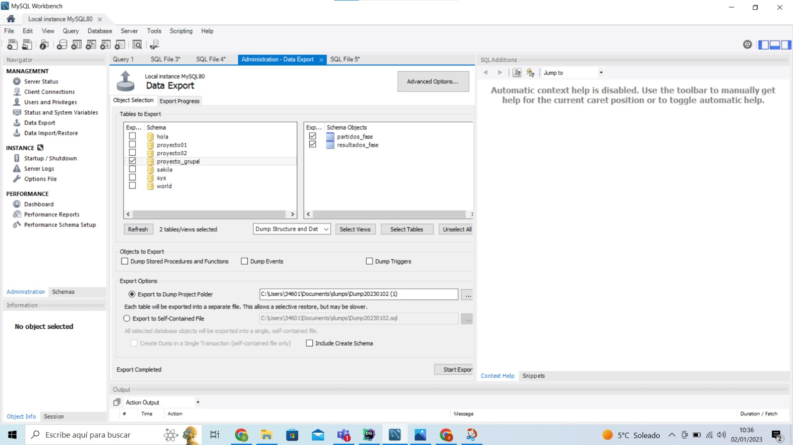

## Instalación
Se debe descargar el instalador de MySQL de su página oficial https://www.mysql.com/. (hay dos instaladores, el que pesa
más permite realizar la instalación sin internet y el otro que es más ligero emplea internet para instalar el programa) 

Cuando se tenga ya descarga el instalador de MySQL, al iniciar la instalación saldra saldra una ventana de aceptar es
uso de licencia. La segunda opción que saldra te pedira elegir el tipo de instalación que vas a realizar en función del
uso que le vayas a dar:
- Default
- Server only
- Client only
- Full
- Custom

Elegimos default, ya que las opciones Default y Full para crear base de datos, siendo Server only para cargar base de
datos ya existentes. La opción "Custom" te permite elegir que productos instalar y cuales no en función de lo que vayas 
a utilizar.
En el apartado de Instalación nos indicara los productos que se van a instalar 

Una vez realizado lo anterior, deberemos acceder al apartado de configuración de MySQL

#### Configuración de MySQL
En la primera parte nos pedira que haga configuraciones del tipo de configuración, que se divide en tres:
- Development Computer: Pensado para equipos dedicados al desarrollo con MySQL. Consume en la medida de lo posible la 
memoria RAM 
- Server Computer: para equipos que van a realizar la función de servidor y no se va a emplear como una herramienta de
desarrollo
- Dedicated Computer: es para aquellos equipos dedicados para el uso exclusivo de MySQL

Puedes también el tipo de puerto a emplear para conectarse al servidor

En la siguiente ventana debemos elegir el metodo para autentificarnos con una contraseña para el root. Luego podemos 
añadir a otro usuario con su permisos y contraseña para evitar utilizar unicamente el root

Luego nos saldra una ventana donde podremos configurar MySQL como un servicio de Windows y añadirle un nombre. Ademas
podemos el modo de arranque del servicio como un usuario normal o como uno personalizado

Al final saldra una ventana con un resumen de todo lo que se va a ejecutar y realizar la instalación con toda la 
configuración

## Diseño

La base de datos que tenemos que realizar es la de **Eurobasket 2022 del torneo Masculino**.
Contiene seis tablas en total:

### Tablas de fases:
#### Primera fase
En la table de la Primera fase tiene siete columnas: la columna con la clave primaria llamada grupo donde se divide a
todos los paises participantes (A, B, C, D) y las seis columnas para los paises que se encuentran dentro de cada grupo
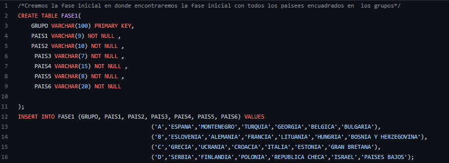

#### Octavos de final
Similar a la primera tabla, con la diferencia de que esta tabla se emplea para los grupos de octavos de final

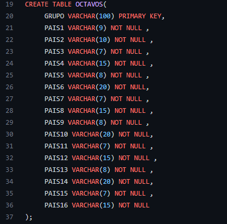

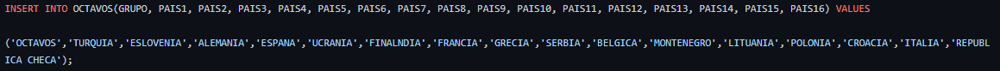

#### Cuartos de final
Esta tabla va dirigido para los cuartos de final

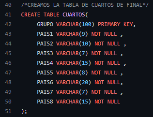

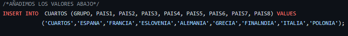

#### Semifinal
Esta tabla muestra los cuatro equipos finalistas

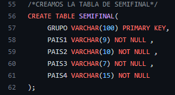

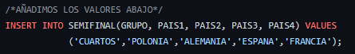

#### Final
Muestra los dos equipos que han llegado a la final

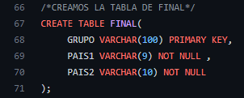

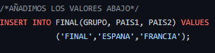
### Tabla MvP:
La tabla MvP permite muestra a los mejores jugadores que mejor han jugado en toda la temporada indicado
el pais al que pertenencen y su nombre
### Tabla CLASIFICACIÓN:
La tabla CLASIFICACIÓN muestra los puestos en los que se encuentran cada equipo, la posición 
final en la que se encuentran, el número de partidas totales jugados por el equipo, los partidos ganados y los perdidos
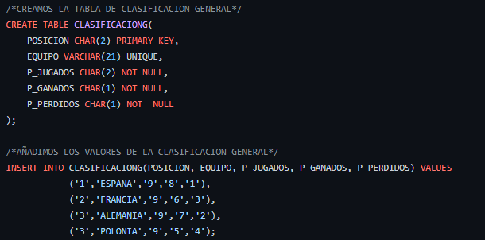

## Conexión
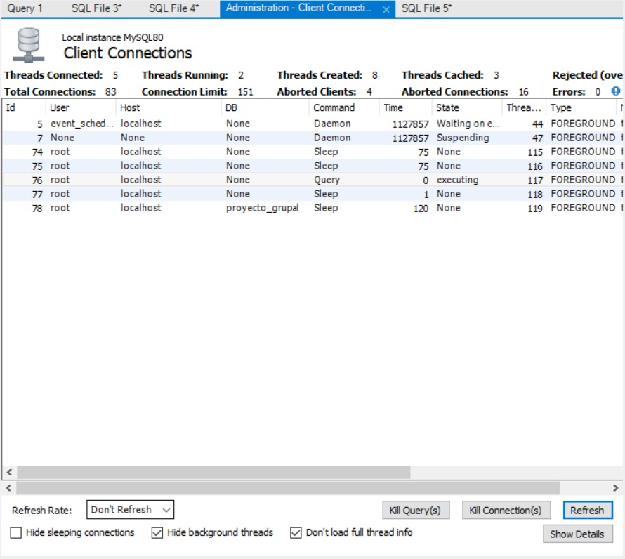
En la captura de pantalla se puede visionar las conexiones que se han realizado. Cada conexión tiene una ID, el usuario
que ha realizado la conexión (el usuario root es el super usuario), en DB indica el nombre de la base de datos (none es 
cuando el usuario que ha realizado una conexión no ha creado ninguna base de datos), la acción realizada en la base de 
datos, el estado actual de la base de datos (si se encuentra en espera y si esta en suspensión, se esta ejecutando o no
se esta realizando nada con la base de datos)

## Conclusiones
Uno de las dificultades a la hora de realizar la practica era instalar MySQL y utilizar MySQL para poder ver la base de 
datos: tuvimos que informarnos de como se debía realizar la instalación, debido a que hicimos la instalación 
sin informarnos antes y a ciegas, haciendo que la instalación sea confusa y sin idea de que opciones nos convienen mejor
o cuales no. Cuando conseguimos finalmente instalar MySQL estuvimos comprobando como hacer que la base se conecte a 
MySQL, al final no hacía falta crear la base de datos con la aplicación de MySQL, ya que se puede crear utilizando
DataGrip y MySQL detecta la base de datos creada desde DataGrip

